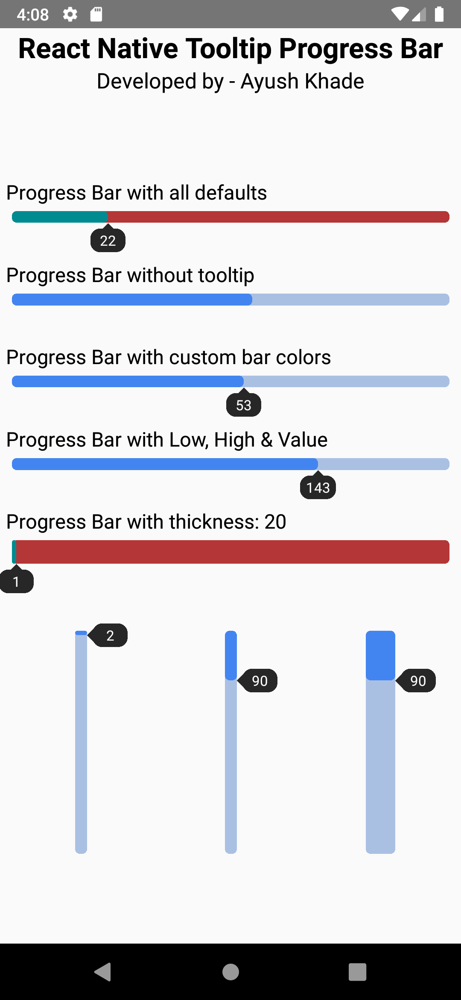

# React Native Tooltip Progress Bar

This React Native Package is developed by Ayush Khade. A simple library for progress bar with a tooltip option and fully customisable.

## Demo



## Installation

- Go to your project's root folder and run `npm install react-native-tooltip-progress-bar` or `yarn add react-native-tooltip-progress-bar`.
- Run `npm run ios` or `npm run android` to start your application!
(Using yarn: `yarn ios` or `yarn android`)

## Usage

```js

import React from 'react';
import {Text, View} from 'react-native';
import RNProgressBar from 'react-native-tooltip-progress-bar';

const App = () => {
  return (
    <>
      <Text
        style={{
          color: 'black',
          fontSize: 24,
          textAlign: 'center',
          fontWeight: 'bold',
        }}>
        React Native Tooltip Progress Bar
      </Text>
      <Text style={{color: 'black', fontSize: 18, textAlign: 'center'}}>
        Developed by - Ayush Khade
      </Text>
      <View style={{flex: 1, justifyContent: 'center', margin: 5}}>
        <View style={{}}>
          <View style={{height: 70}}>
            <Text style={{color: 'black', fontSize: 17}}>
              Progress Bar with all defaults
            </Text>
            <RNProgressBar />
          </View>

          <View style={{height: 70}}>
            <Text style={{color: 'black', fontSize: 17}}>
              Progress Bar without tooltip
            </Text>
            <RNProgressBar
              options={{leftColor: '#4385f0', rightColor: '#aac0e3'}}
              showTooltip={false}
            />
          </View>

          <View style={{height: 70}}>
            <Text style={{color: 'black', fontSize: 17}}>
              Progress Bar with custom bar colors
            </Text>
            <RNProgressBar
              options={{leftColor: '#4385f0', rightColor: '#aac0e3'}}
            />
          </View>

          <View style={{height: 70}}>
            <Text style={{color: 'black', fontSize: 17}}>
              Progress Bar with Low, High & Value
            </Text>
            <RNProgressBar
              options={{leftColor: '#4385f0', rightColor: '#aac0e3'}}
              low={10}
              high={200}
              value={143}
            />
          </View>

          <View style={{height: 70}}>
            <Text style={{color: 'black', fontSize: 17}}>
              Progress Bar with thickness: 20
            </Text>
            <RNProgressBar options={{barThickness: 20}} />
          </View>
        </View>

        <View
          style={{
            flexDirection: 'row',
            marginTop: 30,
            justifyContent: 'center',
          }}>
          <View style={{height: 200, flex: 1, alignItems: 'center'}}>
            <RNProgressBar
              options={{leftColor: '#4385f0', rightColor: '#aac0e3'}}
              type={'vertical'}
            />
          </View>
          <View style={{height: 200, flex: 1, alignItems: 'center'}}>
            <RNProgressBar
              options={{leftColor: '#4385f0', rightColor: '#aac0e3'}}
              type={'vertical'}
              low={30}
              high={300}
              value={90}
            />
          </View>
          <View style={{height: 200, flex: 1, alignItems: 'center'}}>
            <RNProgressBar
              options={{
                leftColor: '#4385f0',
                rightColor: '#aac0e3',
                barThickness: 25,
              }}
              type={'vertical'}
              low={30}
              high={300}
              value={90}
            />
          </View>
        </View>
      </View>
    </>
  );
};
export default App;


```

### Properties for RNProgressBar

| Prop                                 | Description                                                                  | Default                |
| ------------------------------------ | ---------------------------------------------------------------------------- | ---------------------- |
| **`low`**                            | Lower limit of a `Progress Bar`.                                             | `0`                    |
| **`high`**                           | Higher limit of a `Progress Bar`.                                            | `100`                  |
| **`value`**                          | Progres value.                                                               | `Random`               |
| **`type`**                           | Progress Bar type `horizontal` or `vertical`.                                | `horizontal`           |
| **`showTooltip`**                    | Tooltip is `visible` when `true`.                                            | `true`                 |
| **`options`**                        | Options for the Progress Bar                                                 | `{ leftColor:"#008b91", rightColor:"#b53636", barThickness:10 }` |

